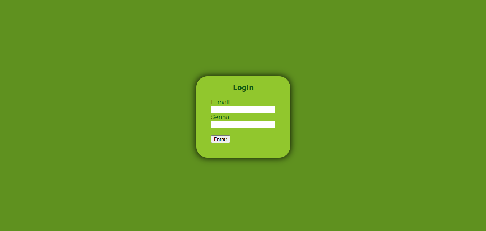
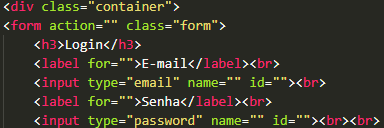
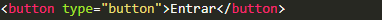

# Projeto - Página de login

Projeto criado como parte da disciplina de Fundamentos de Desenvolvimento, ministrada pelo professor Leonardo Rocha.

## Índice

* [Descrição](#descrição)
* [Recnologias](#tecnologias)
* [Referências](#referencias)
* [Autor(a)](#autora)
### Descrição

O projeto consiste na composição de uma página de login para que um úsuario insira um e-mail e uma senha para entrar em um determinado site.

### Resultado do projeto.



### Login - Entrar

* div - Serve para agrupar blocos de elementos e aplicar estilos CSS a eles. É uma tag muito utilizada para estruturar o layout de uma página da web.
* form - Serve para criar formulários e definir a forma como eles se comportam.
* h3 - Utilizado para criar subtítulos de nível inferior.
* input - Serve para criar campos de entrada de dados interativos, que permitem o usuário insira textos, números, datas, cores, entre outros.
* label - Especifica o rótulo de um input em um formulário, e é importante para a experiência de um usuário.
* br - Cria uma quebra de linha em um texto.

Veja uma imagem de parte do código, onde é possível identificar o uso dos elementos mencionados a cima:



* button - Insere botões clicáveis em páginas e formulários, que podem executar ações quando um usuário clica neles.

Veja mais uma imagem onde pode-se identificar este outro elemento citado acima:



### Estilização

O projeto foi estilizado, utilizando CSS3. Foi criado um arquivo chamado login.css. Neste arquivo, constam as seguintes configurações de estilo:

* Estilo de cores - A cor de fundo utilizada no projeto foi definida como segue:

```
body{
    background-color: rgb(95, 145, 31);
}
```

O elemento citado acima foi utilizado nas seguintes classes no CSS3:

* .form
* .body - Serve para representar tudo o que é exibido na página.

O comportamento do elemento "body" e "container" na págfina foi definido como segue:

```
.container{
    display: flex;
}
```
```
.body{
    display: flex;
}
```

A definição da distância entre o conteúdo de um elemento e suas bordas foi usada nas seguintes classes no arquivo CSS3:

* .form
* html, body

Foi definido com "padding" e "padding-top" como mostra a seguir:

```
html, body{
    padding: 0;
}
```
```
.form{
    padding: 40px;
    padding-top: 0;
}
```

A altura e largura da área do conteúdo de um elemento foi definida com:

* height - Determina a altura da área do conteúdo de um elemento.
* width - Determina a largura da área de conteúdo de um elemento.

Isto foi mostrado no arquivo README e utilizado, por exemplo, na classe "container" em CSS3, como será visto a seguir:

```
.container{
    width: 100%;
    height: 100%;
}
```

As propriedades "justify-content" e "align-items" do CSS3 foram usadas para controlar o alinhamento dos itens em um container flex como segue:

```
.container{
    justify-content: center;
    align-items: center;
}
```

Veja a seguir o que foi feito para alinhar o texto que estava dentro de ".h3", foi usada a propriedade "text-align":

```
h3{
    text-align: center;
}
```


A definição da fonte principal da página, "body", foi definida com "font-family" como se vê a seguir:

```
body{
    font-family: Verdana;
}
```

Foi adicionado também uma caixa para inserir textos, com bordas arredondadas e sombra com as seguintes propriedades:

```
.form{
    border-radius: 30px;
    box-shadow: 0 0 20px black;
}
```

A cor do texto foi definida com a propriedade "color" como mostra a seguir:

```
.form{
    color: rgb(20, 90, 20);
}
```

## Tecnologias

* HTML
* CSS3
* README
* Git
* GitHub

## Referencias
[Alura](https://www.alura.com.br/artigos/escrever-bom-readme) - Como escrever um README íncrivel no seu GitHub.

## Autor(a)

Projeto desenvolvido pela aluna:
* Maria Clara da Silva Gonçalves